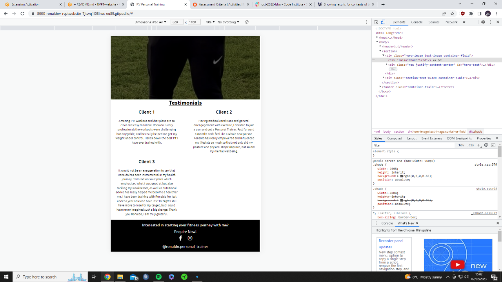
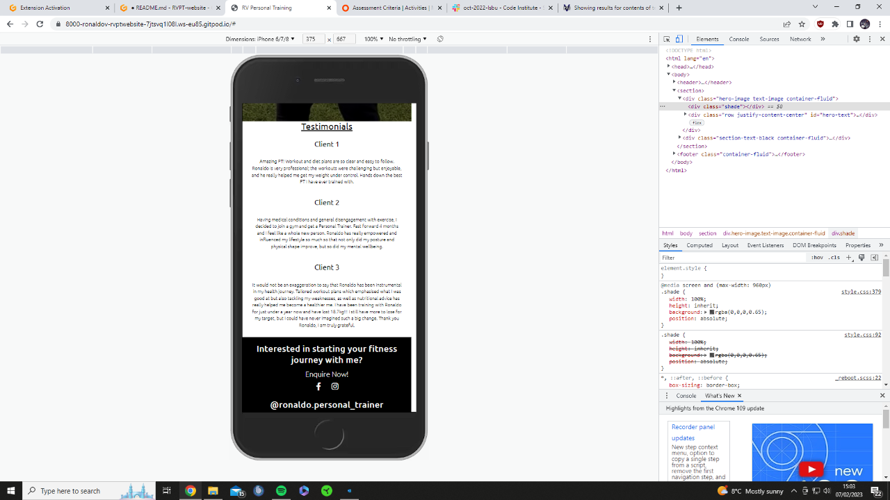
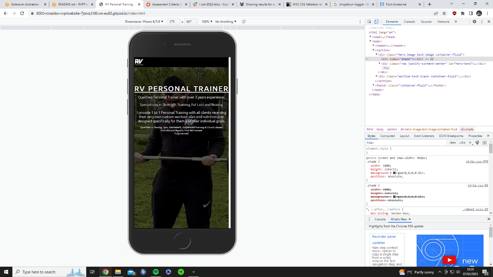
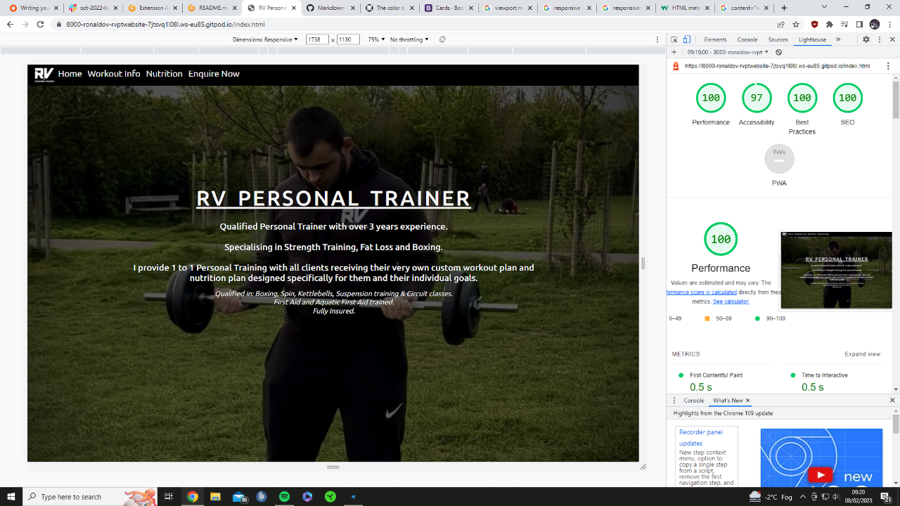
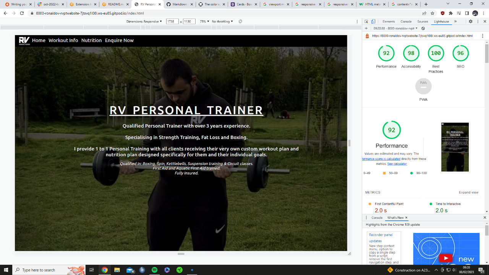
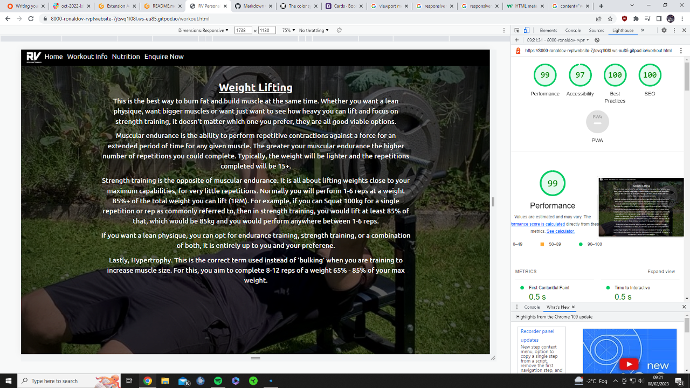
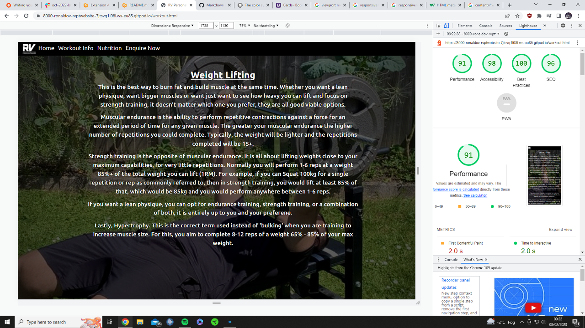

## TESTING

### Responsiveness test
Test home page and workout page on xl, lg, m and s screens.

Check for responsiveness of Nav, general content, images and footer, all get shrink/expand accordingly.

| Content responsiveness for various viewports | Text, images and all other related content should shrink when the device screen width gets smaller | I pressed inspect on my website, selected the device toolbar, changed the device to a smaller screen width | Images and text shrink while layout changes slightly. Relevant photo [here](#content-responsiveness) |
| Website responsiveness for various viewports | My website should not be able to scroll horizontally | I pressed inspect on my website, selected the device toolbar, changed the device to a smaller screen width | I see a thin white trim down the right side of the device likely caused by padding. This does not effect the functionality of the website, but it does not look appealing to users. Relevant photo [here](#website-viewport-for-ipad-and-iphone)|
| Nav responsiveness for various viewports | When I shrink my tab or load the website on a different device, The text, images and display will change slightly to suit the device I am on | I pressed inspect on my website, selected the device toolbar, changed the device to ipad, iphone and other devices | For devices 576px screen width+ there was no issues. But for devices 575px screen width or less, the Navbar disappeared. Relevant photo [here](#nav-viewport-for-iphone)|

- 

- 

- 

### Browser compatibility test
Test website viewports on Chrome and edge, possibly safari too.
Add compatibility table
|   | Chrome | Edge | Safari | 
| --- | --- | --- | --- |
| Intended appearance? | Good | Good | Good |
| Intended responsiveness | Good | Good | Good | 

### Bugs test
Initial bugs. But has now been reolved.

- Website Viewport issue where there is a thin white trim down the right side of some devices. It becomes more noticeable the smaller the device gets. Although no content is hidden, this needs to be fixed. Need to 'inspect' my website and find the issue.
- Nav Viewport issue for devices 575px screen width or less. The Navbar disappears and users cannot navigate through the page. Can be fixed with a dropdown menu for smaller devices. This needs to be fixed ASAP. Have not had enough time to resolve the issue. Image shows the issue to be resolved.
 

Any bugs found?
No bugs found.

### Lighthouse test
- 
- 
- 
- 

### Code validation test (HTML)
- 
- 
- 
- 
- 
- 

### Code validation test (CSS)
- 
- 
- 

### User stroies test
| Expect | Action | Result |
| --- | --- | --- |
| As a website user I want to press on the business logo in the navigation section and be taken to the home page | I pressed on the logo in the navigation section at the top of the website | I was taken to the home page - Success |
| As a website user I want to press on 'home' in the navigation and be taken to the home page | I pressed on 'home' in the navigation | I was taken to the home page of the website - Success |
| As a website user I want to press 'Workout Info' and be taken to the the workout information page | I pressed on 'Workout Info' in the navigation | I was taken to the workout information page - Success |
| As a website user I want to press 'Nutrition' and be taken to the nutrition page | I pressed on 'Nutrition' in the navigation | I was taken to the nutrition page - Success |
| As a website user I want to press 'Enquire Now' and be taken to the enquire page | I pressed on 'Enquire Now' in the navigation | I was taken to the enquire page - Success |
| As a website user I want to press on the instagram icon and be taken to the business' instagram account | I pressed on the instagram icon in the footer | I was taken to the business' instagram account - Success |
| As a website user I want to press on the facebook icon and be taken to the business' facebook account | I pressed on the facebook icon in the footer | I was taken to the business' instagram account - Success |
| As a website user I want to press 'Enquire Now!' in the footer and be taken to the enquire page | I pressed on 'Enquire Now!' in the footer | I was taken to the enquire page - Success |
| As a website user I want to press on the 'NHS Eatwell Guide' link in the nutritions page and be redirected to the NHS Eatwell Guide page on the NHS website | I pressed on 'NHS Eatwell Guide' | I was redirected to the NHS Eatwell Guide page on the NHS website - Success |
| As a website user I want to press on the 'download or print' link in the nutritions page and have a printable/downloadable food planner document | I pressed on 'download or print' | I was redirected to a separate pdf document where I was able to download or print the daily food planner doc. - Success |
| As a website user I want to press on 'submit' in the form section of the enquire now page and my form be submitted | I filled out the form then pressed 'submit' | My form was submitted - Success |
| As a person new to fitness I want to learn new information about workouts | I pressed on 'Workout Info' where I was then able to scroll down through the page reading the information provided on workouts | I was easily able to navigate myself to the workout information page, where I was able to scroll down the page and clearly read the information provided on workouts - Success |
| As a person new to fitness I want to learn new information about food and dieting to help me understand what I should be eating | I pressed on 'Nutrition' where I was then able to scroll down the page reading the information provided on nutrition | I was easily able to navigate myself to the nutrition page, where I was able to scroll down the page and clearly read the information provided on nutrtion - Success |
| As a person new to fitness I want to trust in the business and information provided by seeing positive reviews/testimonials from previous clients | On the home page, first thing I see if an overview of the business with the trainer's qualifications and experience. I then scrolled down where I was able to read some testimonials from previous clients | Clear easy layout where I was able to naviagte myself to the client testimonials - Success |
| As a person wanting a Personal Trainer for myself, I want to learn about the Personal Trainer to find out if he has trained people with similar goals to me | I went to the home page of the website | The trainer's previous experience, qualifications and overview of what he specialises in, were clearly shown as soon as I went onto the home page of website. Additional bonus for reassurance of insurance and first aid - Success |
| As a person wanting a Personal Trainer for myself, I want to see if the trainer knows his stuff and that he can bring me value if I decide to train with him | I navigate through the different pages of the website reading the information provided | There is a lot of information provided and I believe that the trainer can help me with my fitness goals and nutrition goals - Success |
| As a person wanting a Personal Trainer for myself, I want to see client testimonials to see if I can envision myself doing private 1-to-1 sessions with the trainer | On the home page, I scrolled down to the client testimonials section to read the experiences of previous clients | I was able to easily navigate myself to the testimonials section where I was able to read multiple reviews from previous clients, helping me come to a final decision - Success |

As a current client:  
- I need a place where I can track workouts/food intake to see how much I am progressing  
- I need a support center with others going through the same process as me to help me stay on track when I feel like giving up  

### Features test

| Feature | Expect | Action | Result |
| --- | --- | --- | --- |
| Business logo navigation button | When clicked, the home page will open | Clicked on the business logo in the navigation | Home page opened when clicked - Success |
| 'Home' navigation button | When clicked, the home page will open | Clicked 'Home' in the navigation | Home page opened when clicked - Success |
| 'Workout Info' navigation button | When clicked, the workout info page will open | Clicked 'Workout Info' in the navigation | Workout page opened when clicked - Success |
| 'Nutrition' navigation button | When clicked, the nutrition page will open | Clicked 'Nutrition' in the navigation | Nutrition page opened when clicked - Success |
| 'Enquire Now' navigation button | When clicked, the enquire page will open | Clicked 'Enquire Now' in the navigation | Enquire page opened when clicked - Success |
| 'Enquire Now!' footer button | When clicked, the enquire page will open | Clicked 'Enquire Now!' in the footer | Enquire page opened when clicked - Success |
| Facebook link in footer | When clicked, I will be redirected to the business' Facebook account | Clicked on the Facebook icon in the footer section | Was redirected to the facebook page of the business - Success |
| Instagram link in footer | When clicked, I will be redirected to the business' Instagram account | Clicked on the Instagram icon in the footer section | Was redirected to the Instagram page of the business - Success |
| NHS Eatwell Guide link | Press 'NHS Eatwell Guide' and be taken to the NHS website regarding this | Pressed on the NHS Eatwell Guide link in the nutrition page | Was taken to the NHS Eatwell Guide section on the NHS website - Success |
| Daily food planner link | Press 'download or print' and be taken to the downloadable/printable document regarding this | Pressed on the download or print link in the nutritions page above the Eatwell Guide | Was taken to the relevant food planner document where I was able to download and/or print this pdf doc. - Success |
| Form Submit Button | The form submits when the 'submit' button is clicked | Clicked 'submit form' in the form section | The form submitted when the submit button was clicked - Success |
| Hovering over links in the nav, footer and nutrition 'food help' section | When the cursor hovers over a link, the text will change color into green. When the cursor is removed, the text will return to its original white color | I hovered over the links in the nav, footer and nutrition sections | The links changed color into green, then returned to its original white color once the cursor was removed - Success |
| Hovering over the 'submit' button in the form section | When the cursor hovers over the submit button, the text will change color into white with the background green color changing into a darker shade of green. When the cursor is removed, the text and background will return to its original colors | I hovered over the submit button in the form section | The text and background changed colors accordingly, then returned to its original colors once the cursor was removed - Success|